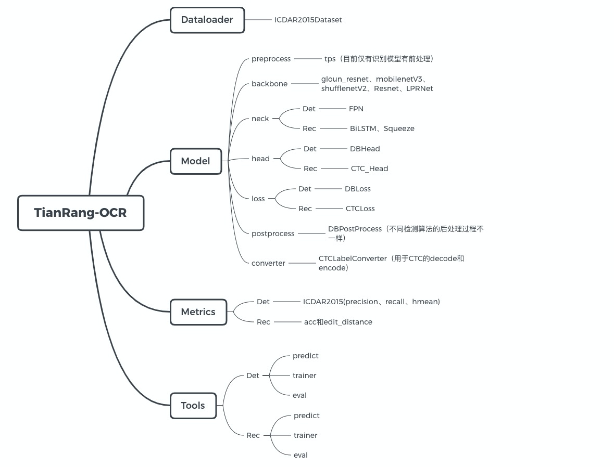

# TianRang-OCR

TianRang-OCR致力于打造一个实用的OCR工具库，集成常见的OCR算法，通过模块化的设计、高灵活性、高拓展性，提升实验效率、生产效率。




## 构建Docker镜像

```shell
docker build --no-cache -t harbor.tianrang.com/traffic/lpr:2.0 .
```


## 开始训练

- [数据集准备](wiki/数据集准备.md)
- [config配置](wiki/config配置示例.md)
- [训练、验证、推理](wiki/训练、验证及推理.md)

- 导出模型：`python -c "python -c "from utils.utils import export_model; export_model('output/shufflenet05_rec/checkpoint/model_best.pth', 'weights/rec_shufflenet.pth')"`


## 车牌识别服务

[车牌识别服务简介](wiki/车牌识别服务简介.md)，其中包括使用场景、可视化样例、精度评估、速度评估、接口文档、web demo等。


## 近期更新

- 2020.9.15，本次更新为tianrang-ocr V2.0版本，主要更新如下：提供新的车牌检测模型；检测支持使用mobilev3为backbone，支持通道的scale；识别模型多次预测, 根据prob选择最优识别结果，会带来额外的时间开销。其他更新参考，[more](wiki/更新.md)


- 2020.7.8，添加算法服务的对外调用接口
- 2020.6.24，添加dockerfile；添加requirments.txt；修复部署时会下载ImageNet预训练模型的问题。
- [more](wiki/更新.md)

## TO DO

### BackBone

- [ ] 支持glouncv Resnet
- [x] mobilenetv3支持检测模型（目前仅支持识别）

### 识别算法

- [ ] Attention

### 检测算法

- [ ] PSENet
- [ ] EAST
- [ ] YOLO

### Dataloader

- [ ] LMDB：文字识别训练，现在效率太低
- [ ] CTW1500

### 其他

- [ ] 识别训练过程tensorboard
- [ ] 多卡训练识别模型
- [ ] 更多开源数据集的训练结果
- [ ] API文档
- [x] Dockerfile
- [x] requirements.txt
- [ ] 文档！文档！文档！！！！

