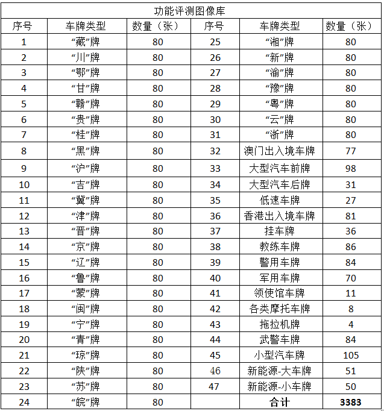

# CCPD数据集简介及结果

## V2.0更新

仅使用功能测评库进行评测，32个省份的车牌，每个省份约80张进行评估，共2549张图片。分别测试集1和测试集2。

| 错误数量                                                     | 功能评测图像库子集1（共1437张图片）              | 功能评测图像库子集2（共1112张图片）                          | 测试集1准确率/测试集2准确率/整体准确率 |
| ------------------------------------------------------------ | ------------------------------------------------ | ------------------------------------------------------------ | -------------------------------------- |
| V1.0                                                         | 74                                               | 118                                                          | 94.85%/89.34%/92.25%                   |
|                                                              |                                                  |                                                              |                                        |
| 加入3000张黄牌和200张新能源车牌，优化多组训练参数进行第一次训练 | 51                                               | 95                                                           | 96.45%/91.46%/94.38%                   |
| 识别模型多次预测(1,1.025,1.05)，会带来额外6ms-10ms的开销     | 25                                               | 90                                                           | 98.26%/91.90%/95.34%                   |
| 继续优化参数进行二次训练                                     | 24                                               | 87                                                           | 98.33%/92.18%/95.65%                   |
| 继续优化参数进行三次训练                                     | 21                                               | 86                                                           |                                        |
| 调整positive thresh=0.5                                      | 13                                               | 86                                                           |                                        |
| 去除测试集中错误样本                                         | 10（-3）                                         | 79（-7）                                                     | 99.30%/92.9%/96.91%                    |
|                                                              | 错误样本如下：吉B3385X、桂K88V15、闽DW3221       | 错误样本如下：豫H82882、云D39P62、宁AON127、新B80052、皖N633OK、豫C82882、青C65583 |                                        |
|                                                              | **10个识别错误来源**：藏牌8张；黄牌1张；黑牌一张 | **79个识别错误来源：澳门出入境车牌77张；新牌2张；**          |                                        |
| 去除港澳车牌进行评估                                         | 10                                               | 2                                                            | **99.30%/99.81%/99.51%**               |

## 数据集简介

[数据集详情、train、val、test划分](Convert CCPD format.md)

## 关于本次训练

本次在CCPD上训练，由于CCPD上只有蓝牌，并且皖牌占大多数，因此本次训练得到的模型不能作为最后的识别模型，还需要添加其他区域的车牌作为补充数据集，本次训练主要为确定如下实验：

- 车牌检测模型结构的有效性
- 车牌识别模型结构的有效性
- 不同backbone的精度、速度、模型大小比较
- tps模块的有效性

## 检测

以下测试均在1080/E5-2630v3@2.40GHz上完成。

检测模型采用train和test进行训练，val进行测试，short_size=416，FPS值仅供参考：

| 模型                              | precision | recall | hmean | FPS（包含后处理） | 模型大小 |
| --------------------------------- | --------- | ------ | ----- | ----------------- | -------- |
| shufflent05_96（weights/det.pth） | 0.984     | 1      | 0.992 | 42                | 2M       |
| resnet18_96                       | 0.989     | 1      | 0.994 | 31                |          |

## 识别

以下测试均在1080/E5-2630v3@2.40GHz上完成。

检测模型采用train进行训练，test进行测试，输出尺寸为32*120，

模型较小，吃不满GPU，未能精确测试速度，FPS在250-350浮动，仅供参考。

| 模型                                                    | Total | DB    | FN    | Challenge | Rotate | Tilt  | Weather | Blur  | FPS  | 模型大小 |
| ------------------------------------------------------- | ----- | ----- | ----- | --------- | ------ | ----- | ------- | ----- | ---- | -------- |
| shufflenet(1.0)+tps(0.25)（weights/rec_shufflenet.pth） | 0.840 | 0.759 | 0.876 | 0.817     | 0.954  | 0.895 | 0.989   | 0.734 | 297  | 7M       |
| mobilnet(small)+tps(0.25)（weights/rec_monbilnet.pth）  | 0.841 | 0.730 | 0.871 | 0.830     | 0.950  | 0.883 | 0.992   | 0.741 | 295  | 11M      |
| resnet18+tps(0.25)（weights/rec_res18.pth）             | 0.881 | 0.819 | 0.909 | 0.866     | 0.968  | 0.935 | 0.995   | 0.792 | 326  | 55M      |
|                                                         |       |       |       |           |        |       |         |       |      |          |
| 以下模型未能精确统计：                                  |       |       |       |           |        |       |         |       |      |          |
| resnet34+tps(0.25)                                      | 0.90  |       |       |           |        |       |         |       |      |          |
| LPRNet                                                  | 0.76  |       |       |           |        |       |         |       |      |          |
| shufflenet（0.5）                                       | 0.73  |       |       |           |        |       |         |       |      |          |
|                                                         |       |       |       |           |        |       |         |       |      |          |

## 其他数据集评测结果

数据集来自：[http://www.openits.cn/openData4/809.jhtml](http://www.openits.cn/openData4/809.jhtml)

使用功能评测库中的1-31的进行评测，使用DBNet(shufflent05_96)作为检测模型：

- shufflenet(1.0)+tps(0.25)作为识别模型：准确率74%
- resnet18+tps(0.25)作为识别模型：准确率85%
- HyperLPR作为识别模型：91%

其中错误包括，车牌（新能源、黄牌）无法检测，部分地区的车牌识别精度差，黄牌效果差。在80张赣牌中，开源模型：2/80，小模型：19/80，大模型：16/80，还需要进一步分析。