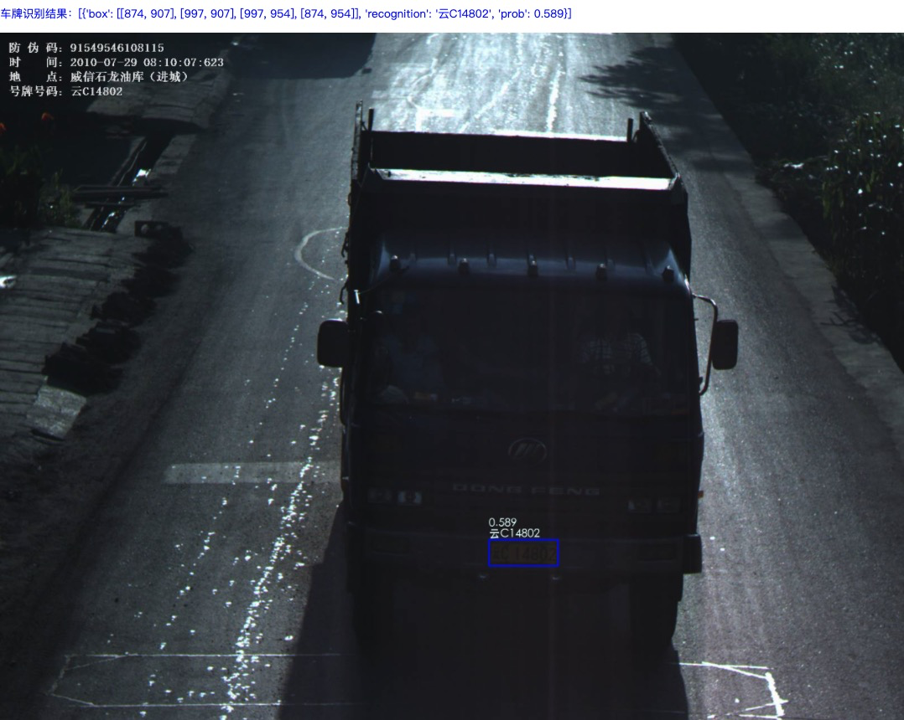
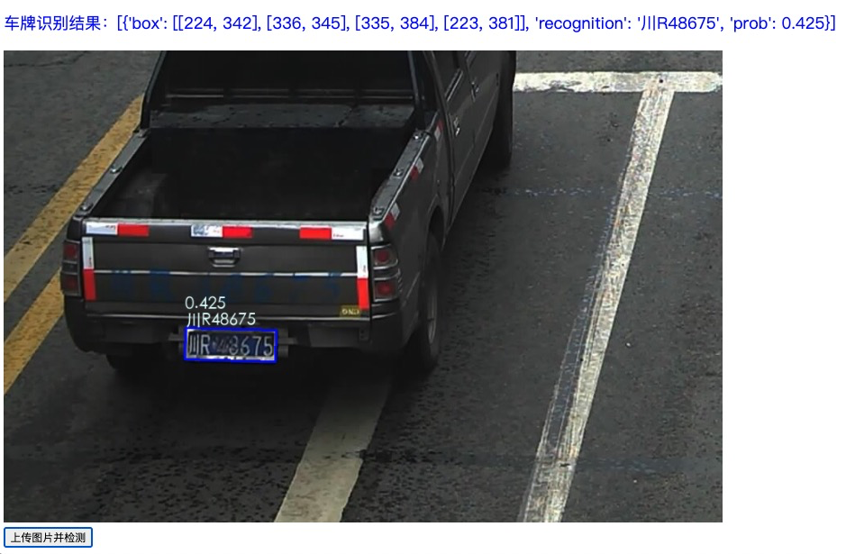
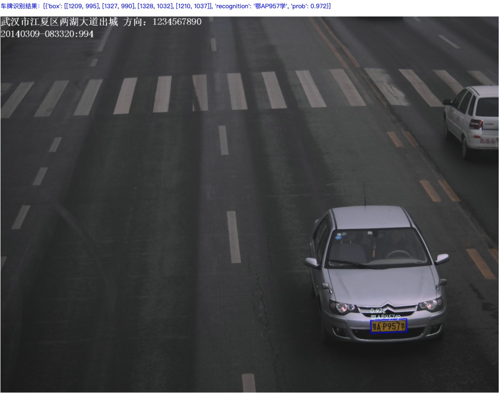
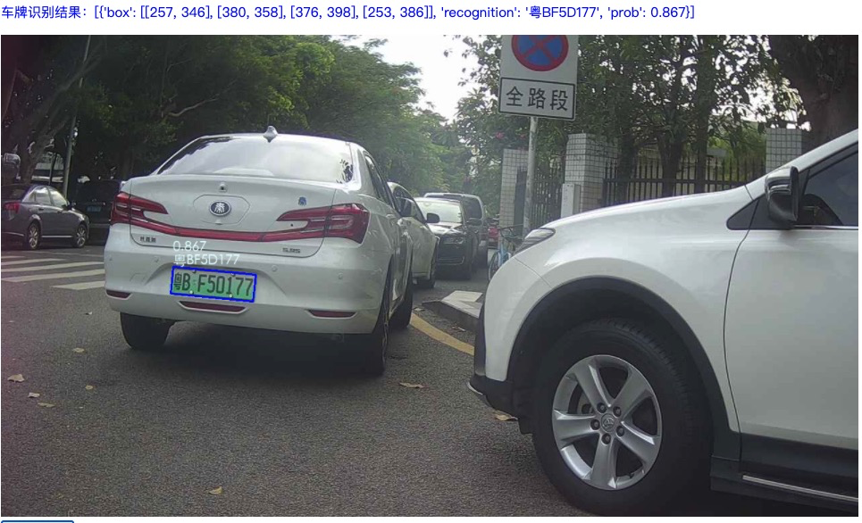
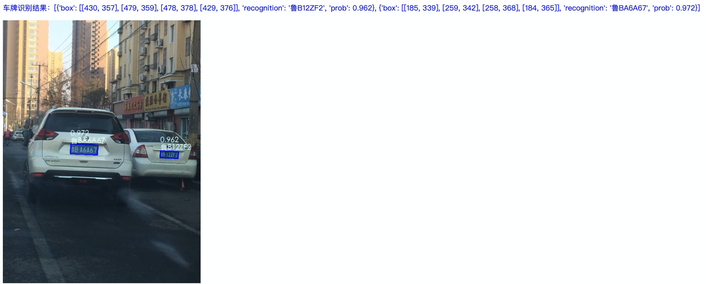
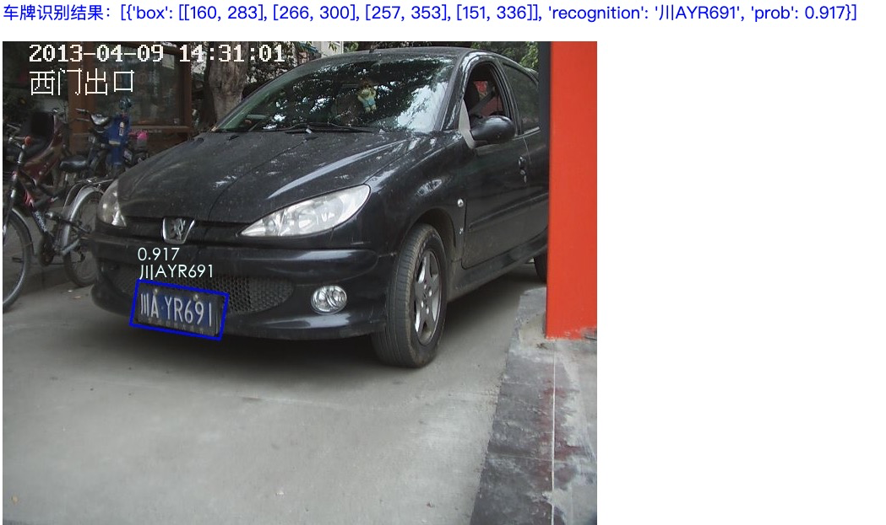

# 车牌识别服务简介

使用此仓库在在CCPD数据集加上自己标注的3000张黄牌以及200张绿牌进行训练，得到车牌检测模型（2M）和车牌识别模型（7M），可以尝试部署在移动端，由于CCPD上只有蓝牌，并且皖牌占大多数，所以目前模型存在以下问题：

- 支持蓝牌、单行黄牌，其他车牌如：新能源车牌、白牌效果较差
- 不支持双行车牌
- 港澳、大使馆、藏牌效果较差
- 识别模型可以进一步压缩

# 车牌识别样例

通过部分可视化样例，简单介绍目前的车牌识别能力及适用场景：

## 1、暗光条件的黄牌识别

## 2、车牌不清晰

## 3、车管所黄牌

## 4、新能源车牌

## 5、多张车牌同时识别

## 6、角度倾斜的车牌

# 精度

[CCPD数据集简介及车牌识别结果](CCPD数据集简介及结果.md)

|      | 功能评测图像库子集1（共1437张图片） | 功能评测图像库子集2（共1112张图片） | 整体准确率                   |
| ---- | ----------------------------------- | ----------------------------------- | ---------------------------- |
| V1.0 | 94.85%                              | 89.34%                              | 92.25%                       |
| V2.0 | 99.30%                              | 92.9%（去除港澳车牌：99.81%）       | 96.91%（去除港澳车牌99.51%） |

# 速度

GPU为GTX1080，CPU为E5-2630v3@2.40GHz，建议使用CPU进行部署。以下为单张图片的速度：

|      | det_short_size=416 | det_short_size=736 | det_short_size=300 |
| ---- | ------------------ | ------------------ | ------------------ |
| GPU  | 63ms               | 75ms               | 60ms               |
| CPU  | 195ms              | 518ms              | 125ms              |

# 接口文档

算法接口统一由`algo_interface.py`提供，模型的启动参数通过`interface_config.json`进行配置。详细参考：[车牌识别算法接口文档](算法接口文档.md)

# 启动Flask Web demo

模型参数的配置和接口文档相同，运行命令：

`python app_demo.py --port 8080`

